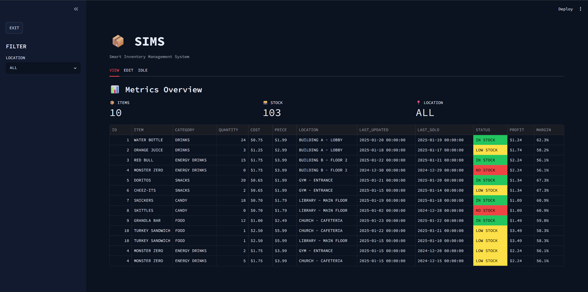
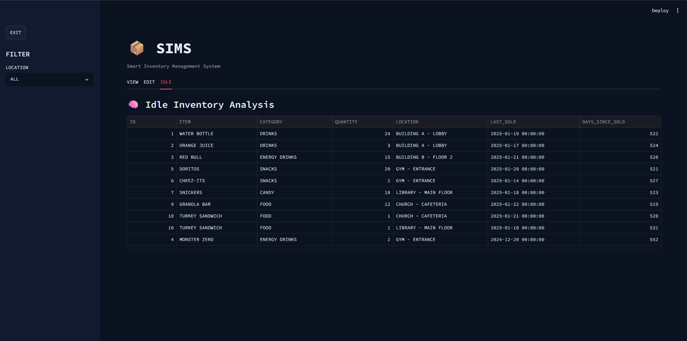
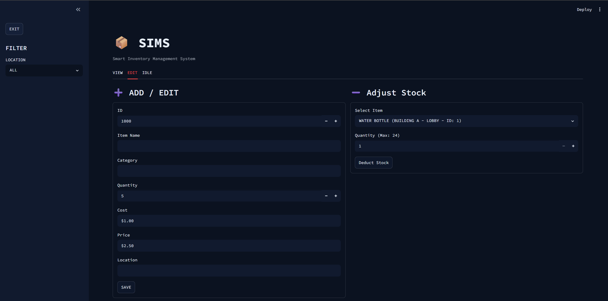

# SIMS | Smart Inventory Management System

## Description
SIMS is an inventory management application built with Python and Streamlit. Features a modular service-layer architecture with inventory tracking, idle-stock analysis, and full CRUD workflows backed by CSV storage.

## Author
Redeate Seife

## Features
- Add, edit, and deduct inventory items across multiple locations
- Status tracking per item: **IN STOCK**, **LOW STOCK**, and **NO STOCK** — derived at runtime, never stored
- Runtime-derived **PROFIT** and **MARGIN** columns calculated from COST and PRICE at display time
- Idle-stock analysis: flags items with remaining quantity but no recorded sale in the past 30 days
- Automatic timestamped data backups on every save
- Modular service-layer architecture separating UI from business logic
- Persistent CSV-based data storage
- Configurable dark theme via `.streamlit/config.toml`

## Requirements
- Python 3.8+
- Streamlit
- pandas
- Windows, macOS, or Linux

## Installation
```bash
pip install streamlit pandas
```

## Instructions
### Run
```bash
streamlit run app.py
```

## Project Structure
```
SIMS/
    app.py                      Application entry point
    config.py                   App-wide configuration constants
    README.md                   Project documentation
 
    .streamlit/
        config.toml             Streamlit server and theme settings
 
    data/
        backups/                Auto-generated timestamped inventory backups
        inventory.csv           Primary inventory data store
 
    services/
        backup_service.py       Handles automatic data backup logic
        inventory_service.py    Core inventory CRUD operations and queries
 
    ui/
        components.py           Tab renderers, metrics, and status styling
 
    utils/
        system_utils.py         OS-level lifecycle utilities (shutdown_server())
```

## Implementation Details
SIMS is built with a modular service-layer architecture that separates concerns across three layers. The UI layer (`ui/`) handles all rendering and user interaction. The service layer (`services/`) contains business logic for inventory operations and backup management, keeping it fully independent from the UI. The data layer persists state to `inventory.csv`, with automatic timestamped backups written to `data/backups/` on every save.
 
`app.py` serves as the entry point, initializing the Streamlit app and routing between tabs. `config.py` centralizes app-wide path constants so configuration changes don't require touching business logic or UI files. Derived fields — STATUS, PROFIT, and MARGIN — are computed at runtime and never written to the CSV, keeping stored data clean.
 
## Additional Information
- Tested on Windows 11 and Linux

## Future Improvements
- Database backend (PostgreSQL or SQLite) to replace CSV storage
- User authentication and role-based access control
- Export inventory reports to CSV or PDF
- Low-stock threshold alerts
- Search and filter functionality
- Charts and dashboards for inventory trends

## Demo
| Inventory | Idle Stock | CRUD |
| :---: | :---: | :---: |
|  |  |  |


